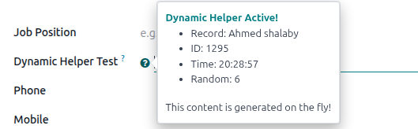
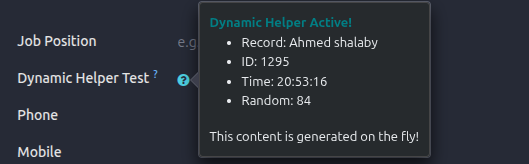

# Dynamic Field Helper

**Author**: HosamAE  
**License**: LGPL-3  
**Version**: 18.0.1.0.0

## Overview

The **Dynamic Field Helper** framework allows developers to add runtime-calculated, dynamic help content to any Odoo field. Unlike the standard `help` attribute which is static, this module enables you to define a Python method (`helper`) on the field, which returns dynamic HTML content (text, tables, lists, etc.) based on the specific record being viewed.

The helper content is displayed in a clean, responsive popover when the user hovers over the helper icon next to the field.

## Key Features

- **Python-Defined Logic**: Use standard Python methods to calculate help content.
- **HTML Support**: Render richness (bold, colors, lists) in your help messages using `markup()`.
- **Context-Aware**: Access the current record (`self`) to show data-dependent help (e.g., "Customer total due is $500").
- **Zero Database Overhead**: content is calculated on-the-fly via RPC, no data is stored.
- **Simple Syntax**: Just add `helper="method_name"` to your field definition.

## Installation

1. Clone/Download this module into your Odoo addons path.
2. Install `dynamic_field_helper` from the Apps menu.
3. Restart your Odoo server.

## Usage

### 1. Define the Helper attribute

In your Python model, add the `helper` attribute to any field. The value should be the name of a method on the same model.

```python
from odoo import models, fields

class MyModel(models.Model):
    _inherit = 'my.model'

    my_field = fields.Char(
        string="My Field",
        helper="_get_my_field_help"  # Point to your method
    )

    def _get_my_field_help(self):
        # Return a string or HTML
        amount = self.amount_total
        return f"""
            <b>Current Status:</b> {self.state}<br/>
            <i>Total Amount:</i> {amount}
        """
```

### 2. Frontend Experience

- A small **?** icon will appear next to the field label.
- **Hovering** over the icon triggers the backend method.
- The result is displayed in a popover.

### Screenshots

<div align="center">
    
    
</div>

## Compatibility

- **Odoo Version**: 18.0
- **Field Types**: Works with all standard field types (Char, Integer, Many2one, etc.).

## Credits

**Concept & Implementation**: HosamAE
